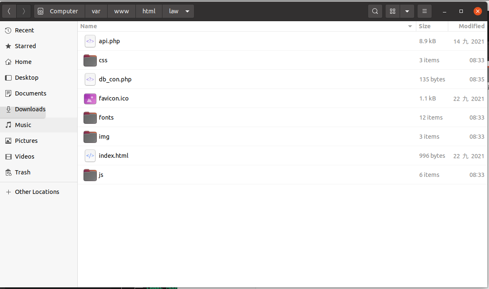

# 環境與流程

## 1. 資料庫環境準備

請先將`資料庫`、`資料表`、`函式`建立好，請參考規劃的`db_init`章節。完成後再依序往下實作。
## 2. 專案說明

此專案是屬於前、後端分離的專案架構。並且必須將來源格式進行轉換，作者使用`python`來進行處理資料、前端使用`vuejs`、後端使用`php` + `mysql`。

以下分三項專案進行說明

- [一、資料轉換專案(`python`)](zh-cn/data_process_project.md)
- [二、前端專案(`vuejs` + `bootstrap-vue`)](zh-cn/front_end_project.md)
- [三、後端專案(`php` + `mysql`)](zh-cn/back_end_project.md)

## 3. 整合

建立一個`law`資料夾

將前端程式碼`dist` copy 至此

將後端程式碼 copy 至此

最後結果如下

