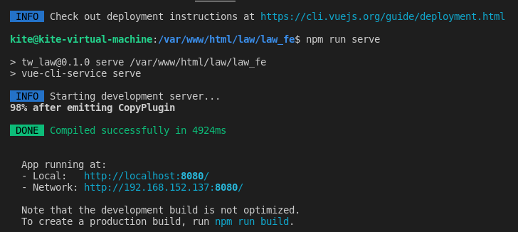

# 環境與流程

此專案是屬於前、後端分離的專案架構。並且必須將來源格式進行轉換，作者使用`python`來進行處理資料、前端使用`vuejs`、後端使用`php` + `mysql`。

以下分3步驟來進行說明

- 資料轉換專案(`python`)
- 前端專案(`vuejs` + `bootstrap-vue`)
- 後端專案(`php` + `mysql`)


## 一、資料轉換專案

### 1. 程式資料夾

```
tw_law\data_process
```


### 2. 環境安裝

確認python版本

```shell
python3 --version
```

安裝python

```sh
sudo apt-get update
sudo apt-get install python3.6
sudo apt install python3-pip
```

安裝套件

```shell
pip3 install pathlib
pip3 install mysql-connector
```


### 3. data_process程式、架構

| 序號 | 程式名稱         | 說明                                                         |
| ---- | ---------------- | ------------------------------------------------------------ |
| 1    | auto_run.py      | 未使用                                                       |
| 2    | config.py        | 相關全域變數設定檔                                           |
| 3    | import_sql.py    | 未使用                                                       |
| 4    | input_file       | 放置download法規的xml檔                                      |
| 5    | output_file      | 放置 output sql 檔                                           |
| 6    | LAWAA_Model.py   | LAWAA 資料表 model ，for main01_LAWAA.py 、main02_LAWAA.py 使用 |
| 7    | LAWAB_Model.py   | LAWAB 資料表 model，for main01_LAWAB.py 、main02_LAWAB.py 使用 |
| 8    | LAWAC_Model.py   | LAWAC 資料表 model，for main01_LAWAC.py 、main02_LAWAC.py 使用 |
| 9    | main01_LAWAA.py  | 執行讀取法規_法律xml，產出LAWAA SQL 放置於output_file        |
| 10   | main01_LAWAB.py  | 執行讀取法規_法律xml，產出LAWAB SQL 放置於output_file        |
| 11   | main01_LAWAC.py  | 執行讀取法規_法律xml，產出LAWAC SQL 放置於output_file        |
| 12   | main02_LAWAA.py  | 執行讀取法規_命令xml，產出LAWAA SQL 放置於output_file        |
| 13   | main02_LAWAB.py  | 執行讀取法規_命令xml，產出LAWAB SQL 放置於output_file        |
| 14   | main02_LAWAC.py  | 執行讀取法規_命令xml，產出LAWAC SQL 放置於output_file        |
| 15   | update_parent.py | 更新父子節點資料，會連線資料庫，請設定好資料庫帳號及密碼     |

### 4. 步驟順序

#### 1. 產出SQL檔

##### 法律資料

1. 執行 LAWAA

```sh
python3 main01_LAWAA.py
```

2. 執行LAWAB
```sh
python3 main01_LAWAB.py
```

3. 執行LAWAC
```sh
python3 main01_LAWAC.py
```

##### 法規資料

1. 執行LAWAA

```sh
python3 main02_LAWAA.py
```

2. 執行LAWAB

```sh
python3 main02_LAWAB.py
```

3. 執行LAWAC

```sh
python3 main02_LAWAC.py
```


#### 2. 建置資料庫schema

請參考規劃的`db_init`

#### 3. 匯入資料

依序執行以下SQL。

請注意帳號密碼、檔案路徑是否正確。

```sh
mysql -ukite -p0000 law < /mnt/hgfs/local_share_to_vm/main01_LAWAA_SQL.sql
mysql -ukite -p0000 law < /mnt/hgfs/local_share_to_vm/main01_LAWAB_SQL.sql
mysql -ukite -p0000 law < /mnt/hgfs/local_share_to_vm/main01_LAWAC_SQL.sql

mysql -ukite -p0000 law < /mnt/hgfs/local_share_to_vm/main02_LAWAA_SQL.sql
mysql -ukite -p0000 law < /mnt/hgfs/local_share_to_vm/main02_LAWAB_SQL.sql
mysql -ukite -p0000 law < /mnt/hgfs/local_share_to_vm/main02_LAWAC_SQL.sql
```


## 二、前端專案

前端使用的是`vuejs`  +`bootstrap-vue` 套件開發而成的。

### 1. 程式資料夾

```
tw_law\law_fe
```

### 2. 環境安裝

請在law_fe 底下執行

1. 安裝nodejs 套件

```
sudo apt install nodejs
```

2. 安裝專案所有套件

```
npm i
```

3. 修正套件

```
npm audit fix
```

4. 安裝 vue cli

```
sudo npm install -g @vue/cli
```

5. rebuild 安裝 (for linux)

```
npm rebuild node-sass
```

6. 運行伺服器

```
npm run serve
```



7. build 程式碼

```
npm run build
```

下完此指令之後，會生產相關靜態程式碼於`dist`資料夾底下

### 3. law_fe程式、架構

| 序號 | 程式名稱            | 說明                                                         |
| ---- | ------------------- | ------------------------------------------------------------ |
| 1    | dist                | npm run build 指令後的output資料夾，之後要用這個資料夾的程式跟後端程式碼合併佈署 |
| 2    | src/api/config.js   | 設定後端api url path                                         |
| 3    | src/router/index.js | 設定路由                                                     |
| 4    | src/views           | 撰寫vue 程式碼                                               |
| 5    | src/main.js         | vue 路口,引用相關套件                                        |


## 三、後端專案

### 1. 程式資料夾

```
tw_law\law_be
```

### 2. 環境安裝

建議安裝 `php 7.0` 以上

### 3. law_be程式、架構

| 序號 | 程式名稱   | 程式說明           |
| ---- | ---------- | ------------------ |
| 1    | db_con.php | 資料庫帳號密碼設定 |
| 2    | api.php    | 後端api 介面       |


## 四、整合

建立一個`law`資料夾

將前端程式碼`dist` copy 至此

將後端程式碼 copy 至此

最後樣貌如下


